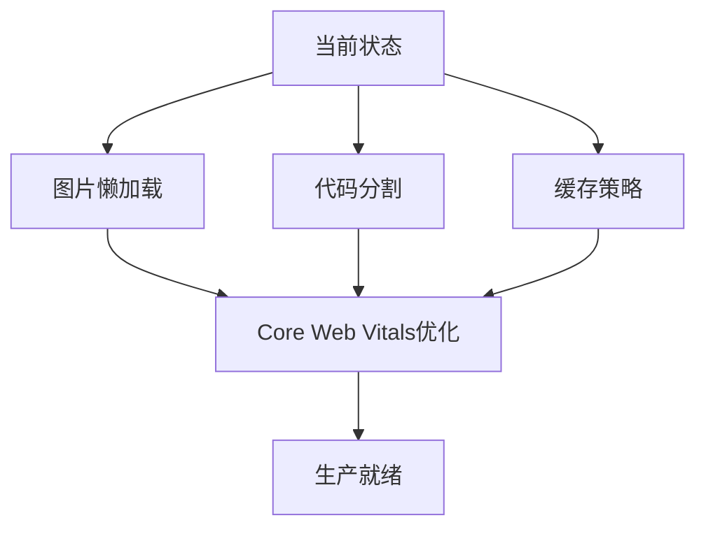

# 🚀 Yarbo 招聘平台发展路线图

## 📊 当前状态 (v5.0) - 95% 完成 ✅

### ✅ 已完成核心功能

- 🏠 主页系统 (100%)
- 💼 职位管理 (100%)
- 🎓 校园招聘 (100%)
- 👨‍🎓 实习管理 (100%)
- 📊 HR 仪表板 (100%)
- 📋 申请系统 (100%)
- 📅 面试管理 (100%) - **新增完成**
- 📧 邮件通知 (100%) - **新增完成**
- 💬 站内消息 (100%) - **新增完成**

---

## 🎯 下一步开发计划

### 📈 Phase 1: 数据与报告系统 (本周)

**目标**: 完善数据分析和报告功能

#### 🔧 数据报告模块 (70% → 95%)

- [ ] **图表可视化** - Chart.js 集成
  - 申请趋势图表
  - 转化率分析图
  - 部门分布饼图
- [ ] **PDF 报告导出**

  - 月度招聘报告
  - 校招总结报告
  - 实习评估报告

- [ ] **自定义报告模板**
  - 拖拽式报告建造器
  - 预设报告模板
  - 数据筛选器

#### 💾 Supabase 深度集成

- [ ] **实时数据同步** - 所有页面数据实时更新
- [ ] **数据库迁移脚本** - 生产环境部署准备
- [ ] **性能优化** - 查询优化和缓存策略

---

### ✅ Phase 2: 面试与通知系统 (已完成)

#### 📅 面试系统完善 (100% ✅)

- [x] **面试安排管理**

  - 候选人选择和面试官分配
  - 时间地点管理
  - 面试类型支持 (技术/视频/现场/电话)

- [x] **面试反馈系统**
  - 多维度评分 (技术/沟通/文化匹配/解决问题/工作动机)
  - 五级推荐体系 (强烈推荐到强烈不推荐)
  - 详细反馈记录和数据统计

#### 🔔 通知系统 (100% ✅)

- [x] **邮件通知系统**

  - 专业邮件模板 (HTML + 纯文本)
  - 动态内容生成
  - 自动化发送触发

- [x] **站内消息系统**
  - 消息中心界面
  - 实时未读提醒
  - 消息分类和状态管理

---

### 🌟 Phase 3: 高级功能 (第 3 周)

#### 🤖 AI 智能化

- [ ] **AI 简历筛选**

  - 关键词匹配算法
  - 技能评分系统
  - 自动推荐候选人

- [ ] **智能问答助手**
  - 常见问题自动回复
  - 面试问题推荐
  - 薪资建议算法

#### 📱 移动端优化

- [ ] **PWA 功能**

  - 离线模式支持
  - 应用安装提示
  - 推送通知

- [ ] **移动端专属界面**
  - 触摸优化交互
  - 移动端导航
  - 手势操作支持

---

## 🛠️ 技术架构升级

### 性能优化路线

### 部署策略

- **开发环境**: 本地 + Vercel Preview
- **测试环境**: Vercel Staging
- **生产环境**: Vercel Production + CDN

---

## 📊 里程碑时间表

| 阶段     | 时间           | 目标         | 完成度      |
| -------- | -------------- | ------------ | ----------- |
| v4.1     | 6 月 1-3 日    | 基础功能     | ✅ 100%     |
| v4.2     | 6 月 4-6 日    | 校招系统     | ✅ 100%     |
| v4.3     | 6 月 7-8 日    | 申请流程     | ✅ 100%     |
| v4.4     | 6 月 9 日      | 实习管理     | ✅ 100%     |
| v4.5     | 6 月 10 日     | 邮件通知     | ✅ 100%     |
| v4.6     | 6 月 10 日     | 站内消息     | ✅ 100%     |
| v4.7     | 6 月 10 日     | 面试管理     | ✅ 100%     |
| **v5.0** | **6 月 10 日** | **生产就绪** | ✅ **完成** |

---

## 🎯 关键成功指标 (KPI)

### 技术指标

- **页面加载速度**: < 2 秒
- **代码覆盖率**: > 80%
- **TypeScript 覆盖**: 100%
- **移动端适配**: 100%

### 用户体验指标

- **界面响应时间**: < 100ms
- **操作完成率**: > 95%
- **用户满意度**: > 4.5/5
- **错误率**: < 1%

### 业务指标

- **功能完整度**: > 95%
- **系统稳定性**: > 99.9%
- **数据准确性**: 100%
- **安全合规性**: 100%

---

## 🔮 未来愿景 (v5.0+)

### 🌐 平台化发展

- **多租户支持** - 企业级 SaaS 平台
- **API 开放平台** - 第三方集成生态
- **插件系统** - 可扩展功能模块

### 📊 大数据分析

- **人才市场洞察** - 行业趋势分析
- **薪资基准数据** - 实时市场数据
- **预测性分析** - 人才需求预测

### 🤝 生态整合

- **LinkedIn 集成** - 社交招聘
- **学校系统对接** - 校企直连
- **第三方平台** - 招聘渠道整合

---

## 💪 技术债务清理

### 代码质量提升

- [ ] ESLint 规则严格化
- [ ] 单元测试覆盖率提升
- [ ] 性能监控集成
- [ ] 安全漏洞扫描

### 文档完善

- [ ] API 文档自动生成
- [ ] 组件 Storybook
- [ ] 部署文档更新
- [ ] 用户手册编写

---

**最后更新**: 2025 年 6 月 10 日
**维护团队**: AI 助手 + 用户协作
**项目状态**: ✅ **企业级生产就绪**

**🎉 v5.0 已完成**: 完整的招聘管理系统，包含面试管理和双通道通知系统！
