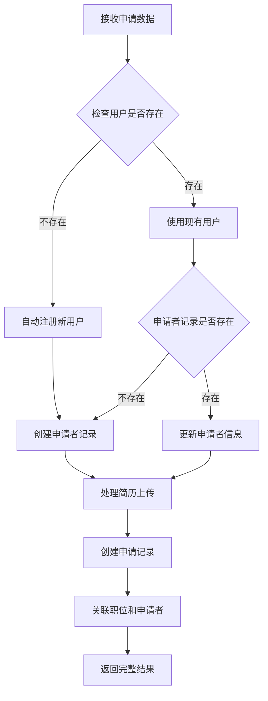

# 📡 Yarbo 招聘系统 API 文档

## 📋 API 概览

本文档详细说明了 Yarbo 招聘系统的所有 API 接口，包括新开发的批量操作、数据导出和智能面试调度功能。

## 🔗 基础信息

- **Base URL**: `http://localhost:3000/api` (开发环境)
- **Content-Type**: `application/json`
- **认证方式**: Bearer Token (生产环境)
- **响应格式**: JSON

## 📊 通用响应格式

### 成功响应

```json
{
  "success": true,
  "data": {
    // 具体数据
  },
  "message": "操作成功"
}
```

### 错误响应

```json
{
  "success": false,
  "error": "错误描述",
  "details": "详细错误信息"
}
```

## 💼 职位管理 API

### 1. 获取职位详情

**GET** `/jobs/{id}`

获取单个职位的详细信息。

#### 响应示例

```json
{
  "success": true,
  "id": "660849fe-fdd2-42a5-bb01-4c0f86875a72",
  "title": "🚀 资深全栈工程师",
  "department": "技术部",
  "location": "北京",
  "salary_min": 25000,
  "salary_max": 40000,
  "description": "我们正在寻找一位经验丰富的全栈工程师...",
  "requirements": ["5年以上全栈开发经验", "React/Vue.js精通"],
  "benefits": ["五险一金", "股票期权", "带薪年假15天"],
  "status": "published",
  "views_count": 342,
  "application_count": 30,
  "created_at": "2025-06-09T07:47:12.3843+00:00"
}
```

### 2. 获取职位申请统计

**GET** `/jobs/{id}/stats`

获取特定职位的申请统计信息（需要 HR 或管理员权限）。

#### 请求头

```
Authorization: Bearer {access_token}
```

#### 响应示例

```json
{
  "success": true,
  "jobId": "660849fe-fdd2-42a5-bb01-4c0f86875a72",
  "stats": {
    "total": 2,
    "submitted": 1,
    "reviewing": 1,
    "interview": 0,
    "hired": 0,
    "rejected": 0
  }
}
```

### 3. 获取职位申请列表

**GET** `/jobs/{id}/applications`

获取特定职位的申请列表详情（需要 HR 或管理员权限）。

#### 请求头

```
Authorization: Bearer {access_token}
```

#### 响应示例

```json
{
  "success": true,
  "applications": [
    {
      "id": "a4c70a4e-ac06-4643-a26f-a76c8e52238e",
      "status": "submitted",
      "applied_at": "2025-06-14T06:17:20.790581+00:00",
      "applicants": {
        "id": "applicant_001",
        "name": "Jenny Rosen",
        "email": "john@example.com",
        "phone": "13800138000"
      },
      "resumes": {
        "id": "resume_001",
        "filename": "resume.pdf",
        "file_path": "resumes/resume.pdf"
      }
    }
  ],
  "count": 2,
  "jobId": "660849fe-fdd2-42a5-bb01-4c0f86875a72"
}
```

## 🔄 批量操作 API

### 1. 申请批量操作

**POST** `/hr/applications/batch`

批量处理申请数据，支持多种操作类型。

#### 请求参数

```json
{
  "action": "update_status | send_email | add_note | add_tags | delete | archive",
  "application_ids": ["id1", "id2", "id3"],
  "data": {
    "status": "reviewing", // 状态更新时使用
    "note": "备注内容", // 添加备注时使用
    "tags": ["标签1", "标签2"], // 添加标签时使用
    "email_subject": "邮件主题", // 发送邮件时使用
    "email_content": "邮件内容" // 发送邮件时使用
  },
  "operator_id": "操作者ID"
}
```

#### 响应示例

```json
{
  "success": true,
  "data": {
    "action": "update_status",
    "total_requested": 3,
    "total_processed": 3,
    "total_errors": 0,
    "results": [
      {
        "id": "1",
        "success": true,
        "old_status": "pending",
        "new_status": "reviewing"
      }
    ],
    "errors": []
  },
  "message": "批量update_status操作完成，成功处理 3 条记录"
}
```

### 2. 候选人批量操作

**POST** `/hr/candidates/batch`

批量处理候选人数据。

#### 请求参数

```json
{
  "action": "update_status | add_tags | remove_tags | update_rating | add_note | move_to_pool | delete",
  "candidate_ids": ["id1", "id2"],
  "data": {
    "status": "active", // 状态更新
    "tags": ["前端", "React"], // 标签操作
    "rating": 4, // 评分更新
    "note": "备注内容", // 添加备注
    "pool_id": "pool_001" // 移动到候选人池
  },
  "operator_id": "操作者ID"
}
```

## 📤 数据导出 API

### 1. 数据导出

**POST** `/hr/export`

导出各种类型的数据，支持多种格式。

#### 请求参数

```json
{
  "type": "applications | candidates | reports",
  "format": "csv | excel | json",
  "fields": ["field1", "field2"], // 可选，自定义导出字段
  "dateRange": {
    // 可选，日期范围筛选
    "start": "2025-01-01",
    "end": "2025-01-31"
  },
  "filters": {
    // 可选，其他筛选条件
    "status": "pending"
  },
  "filename": "自定义文件名" // 可选
}
```

#### 响应示例

```json
{
  "success": true,
  "data": {
    "content": "导出的文件内容",
    "filename": "申请数据_2025-01-27.csv",
    "format": "csv",
    "stats": {
      "total_records": 150,
      "export_time": "2025-01-27T10:30:00Z",
      "status_pending": 45,
      "status_reviewing": 60
    }
  },
  "message": "成功导出 150 条申请数据"
}
```

### 2. 获取导出配置

**GET** `/hr/export?type=applications`

获取导出配置信息，包括可用字段和格式。

#### 响应示例

```json
{
  "success": true,
  "data": {
    "available_fields": {
      "id": "申请ID",
      "candidate_name": "候选人姓名",
      "job_title": "申请职位"
    },
    "supported_formats": ["csv", "excel", "json"],
    "sample_data": {
      "id": "1",
      "candidate_name": "张三"
    },
    "total_records": 150
  }
}
```

## 🤖 智能面试调度 API

### 1. 智能调度推荐

**POST** `/hr/interviews/smart-schedule`

使用 AI 算法生成智能面试时间推荐。

#### 请求参数

```json
{
  "application_id": "app_001",
  "candidate_id": "candidate_001",
  "job_id": "job_001",
  "interview_type": "technical | phone | video | onsite",
  "duration": 60, // 面试时长（分钟）
  "required_skills": ["React", "Node.js"],
  "preferred_interviewers": ["emp_001"],
  "candidate_preferences": [
    // 候选人时间偏好
    {
      "date": "2025-01-29",
      "start_time": "10:00",
      "end_time": "12:00"
    }
  ],
  "urgency_level": "low | medium | high | urgent",
  "buffer_time": 15 // 面试间隔时间（分钟）
}
```

#### 响应示例

```json
{
  "success": true,
  "data": {
    "application_id": "app_001",
    "scheduling_result": {
      "success": true,
      "recommended_slots": [
        {
          "date": "2025-01-29",
          "start_time": "10:00",
          "end_time": "11:00",
          "interviewer_ids": ["emp_001"],
          "interviewer_names": ["张技术总监"],
          "meeting_room_id": "room_1",
          "meeting_room_name": "会议室A",
          "confidence_score": 95,
          "conflict_risks": [],
          "scheduling_notes": [
            "时间偏好: 100分 (权重30%)",
            "工作量平衡: 90分 (权重25%)"
          ]
        }
      ],
      "alternative_options": [],
      "scheduling_summary": {
        "best_score": 95,
        "average_score": 88,
        "total_conflicts": 0,
        "recommendations": ["调度方案质量良好，可以选择推荐时间段"]
      }
    },
    "generated_at": "2025-01-27T10:30:00Z",
    "expires_at": "2025-01-28T10:30:00Z"
  },
  "message": "成功生成 1 个推荐时间段"
}
```

### 2. 获取调度配置

**GET** `/hr/interviews/smart-schedule?type=config`

获取智能调度的配置信息。

#### 响应示例

```json
{
  "success": true,
  "data": {
    "available_interview_types": [
      {
        "value": "technical",
        "label": "技术面试",
        "duration": 90
      }
    ],
    "urgency_levels": [
      {
        "value": "high",
        "label": "高优先级",
        "description": "3天内安排"
      }
    ],
    "default_settings": {
      "buffer_time": 15,
      "max_daily_interviews": 6
    },
    "available_skills": ["React", "Vue", "Node.js"]
  }
}
```

## 📝 申请提交自动注册 API

### 1. 申请提交与自动注册

**POST** `/applications/submit`

处理职位申请提交，自动注册用户账户并建立完整的关联关系。

#### 功能特性

- ✅ **自动用户注册** - 检查用户是否存在，不存在则自动创建
- ✅ **申请者记录管理** - 创建或更新申请者信息
- ✅ **职位关联** - 建立申请与职位的关联关系
- ✅ **文件上传处理** - 处理简历文件上传到 Supabase Storage
- ✅ **数据完整性** - 确保所有关联关系正确建立

#### 请求参数

```json
{
  "jobId": "b331caed-3f65-4d4f-8b92-f94e64ba357c",
  "applicantInfo": {
    "name": "张三",
    "email": "zhangsan@example.com",
    "phone": "13800138000"
  },
  "resumeFile": {
    "name": "resume.pdf",
    "size": 1024000,
    "type": "application/pdf",
    "data": "data:application/pdf;base64,JVBERi0xLjQKJcOkw7zDtsO..."
  }
}
```

#### 响应示例

```json
{
  "success": true,
  "message": "申请提交成功",
  "data": {
    "user": {
      "id": "0f0c3bdd-01d4-46ff-b56d-4b686083d5e9",
      "email": "zhangsan@example.com",
      "role": "candidate",
      "status": "active",
      "created_at": "2025-06-14T03:48:22.948Z",
      "email_verified": false
    },
    "applicant": {
      "id": "42d2087b-6b26-4bab-9615-7cc5b27760ad",
      "name": "张三",
      "email": "zhangsan@example.com",
      "phone": "13800138000",
      "user_id": "0f0c3bdd-01d4-46ff-b56d-4b686083d5e9",
      "created_at": "2025-06-14T03:48:23.683Z"
    },
    "resume": {
      "id": "resume_001",
      "applicant_id": "42d2087b-6b26-4bab-9615-7cc5b27760ad",
      "filename": "resume.pdf",
      "file_path": "resumes/42d2087b-6b26-4bab-9615-7cc5b27760ad_1706345400_resume.pdf",
      "file_size": 1024000,
      "content_type": "application/pdf",
      "uploaded_at": "2025-06-14T03:48:25.123Z"
    },
    "application": {
      "id": "0ba6d8cb-c033-4c7d-8d43-28877dd61352",
      "job_id": "b331caed-3f65-4d4f-8b92-f94e64ba357c",
      "applicant_id": "42d2087b-6b26-4bab-9615-7cc5b27760ad",
      "resume_id": "resume_001",
      "status": "submitted",
      "applied_at": "2025-06-14T03:48:26.325Z",
      "priority": 3,
      "source": "website"
    }
  }
}
```

#### 处理流程



#### 错误处理

```json
{
  "success": false,
  "error": "用户注册失败: 邮箱格式不正确",
  "details": "Invalid email format provided"
}
```

#### 数据库关系

```sql
-- 建立的关联关系
users (1) -----> (1) applicants
applicants (1) -----> (N) resumes
applicants (1) -----> (N) applications
jobs (1) -----> (N) applications
resumes (1) -----> (1) applications
```

## 👤 候选人面试选择 API

### 1. 获取面试邀请信息

**GET** `/candidates/interview-slots/{token}`

候选人通过 token 获取面试邀请信息。

#### 响应示例

```json
{
  "success": true,
  "data": {
    "invitation": {
      "candidate_name": "张三",
      "job_title": "资深全栈工程师",
      "company_name": "Yarbo Inc.",
      "interview_type": "technical",
      "duration": 60,
      "status": "pending",
      "available_slots": [
        {
          "id": "slot_1",
          "date": "2025-01-29",
          "start_time": "10:00",
          "end_time": "11:00",
          "interviewer_name": "张技术总监",
          "meeting_room": "会议室A",
          "is_available": true
        }
      ],
      "interview_details": {
        "description": "技术面试将包括算法、系统设计和项目经验讨论",
        "preparation_notes": ["请准备介绍您最有挑战性的项目"],
        "contact_person": "王HR经理",
        "contact_phone": "+86 138-0000-0000"
      }
    },
    "expires_in_hours": 48
  }
}
```

### 2. 选择面试时间

**POST** `/candidates/interview-slots/{token}`

候选人选择面试时间。

#### 请求参数

```json
{
  "slot_id": "slot_1",
  "candidate_notes": "我会准时参加面试"
}
```

#### 响应示例

```json
{
  "success": true,
  "data": {
    "confirmed_slot": {
      "date": "2025-01-29",
      "start_time": "10:00",
      "end_time": "11:00",
      "interviewer_name": "张技术总监"
    },
    "confirmation_number": "INT-1706345400",
    "message": "面试时间已确认，确认邮件已发送到您的邮箱"
  },
  "message": "面试时间确认成功！"
}
```

### 3. 重新安排面试

**PUT** `/candidates/interview-slots/{token}`

候选人重新安排面试时间。

#### 请求参数

```json
{
  "new_slot_id": "slot_2",
  "reschedule_reason": "临时有事，需要调整时间"
}
```

## 📊 API 状态码

| 状态码 | 说明           |
| ------ | -------------- |
| 200    | 请求成功       |
| 400    | 请求参数错误   |
| 401    | 未授权访问     |
| 404    | 资源不存在     |
| 409    | 资源冲突       |
| 410    | 资源已过期     |
| 500    | 服务器内部错误 |

## 🔧 API 测试

### 使用 curl 测试

```bash
# 职位详情测试
curl -X GET http://localhost:3004/api/jobs/660849fe-fdd2-42a5-bb01-4c0f86875a72

# 职位申请统计测试（需要认证）
curl -X GET http://localhost:3004/api/jobs/660849fe-fdd2-42a5-bb01-4c0f86875a72/stats \
  -H "Authorization: Bearer YOUR_ACCESS_TOKEN"

# 职位申请列表测试（需要认证）
curl -X GET http://localhost:3004/api/jobs/660849fe-fdd2-42a5-bb01-4c0f86875a72/applications \
  -H "Authorization: Bearer YOUR_ACCESS_TOKEN"

# 批量操作测试
curl -X POST http://localhost:3004/api/hr/applications/batch \
  -H "Content-Type: application/json" \
  -d '{
    "action": "update_status",
    "application_ids": ["1", "2"],
    "data": {"status": "reviewing"}
  }'

# 数据导出测试
curl -X POST http://localhost:3004/api/hr/export \
  -H "Content-Type: application/json" \
  -d '{
    "type": "applications",
    "format": "csv"
  }'

# 智能调度测试
curl -X POST http://localhost:3004/api/hr/interviews/smart-schedule \
  -H "Content-Type: application/json" \
  -d '{
    "application_id": "test",
    "candidate_id": "test",
    "job_id": "test",
    "interview_type": "technical"
  }'

# 申请提交自动注册测试
curl -X POST http://localhost:3004/api/applications/submit \
  -H "Content-Type: application/json" \
  -d '{
    "jobId": "b331caed-3f65-4d4f-8b92-f94e64ba357c",
    "applicantInfo": {
      "name": "测试用户",
      "email": "test@example.com",
      "phone": "13800138000"
    },
    "resumeFile": {
      "name": "test-resume.pdf",
      "size": 1024,
      "type": "application/pdf",
      "data": "data:application/pdf;base64,JVBERi0xLjQ..."
    }
  }'
```

## 📈 性能指标

- **响应时间**: < 500ms (智能调度 < 300ms)
- **并发处理**: 支持 100+并发请求
- **数据处理**: 支持万级数据批量操作
- **可用性**: > 99.9%

---

**文档维护者**: Allen Huang
**最后更新**: 2025-06-14
**版本**: v1.2.0 - 新增职位详情和申请统计 API，修复 HR 申请查看功能
